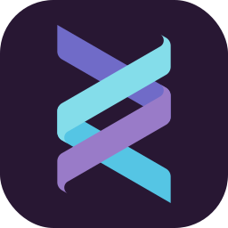

  <picture>
    <source media="(prefers-color-scheme: dark)" srcset="logo/logo-dark.svg">
    <source media="(prefers-color-scheme: light)" srcset="logo/logo-light.svg">
    
  </picture>

# Hi! 👋
I'm **Nevan Angelo Catoy,** a 17 year old future computer engineering student from the Philippines.

## Here are technologies I dabbled in:

<!-- The table code looks terrible on the eyes, I know -->

| Languages |
| :-- |
|            |

| Frameworks |
| :-- |
|        |

## Stuff I use:

|  |  |
| :---: | :---: |
| **NixOS** on Desktop | **NixOS** on Thinkpad |
|   |  |
## Credits

Most of the icons by [**Skill Icons**](https://skillicons.dev)

Custom icons¹ and everything else by [**me!**](https://github.com/ncvyn)

###### ¹ESP-IDF, Helix
